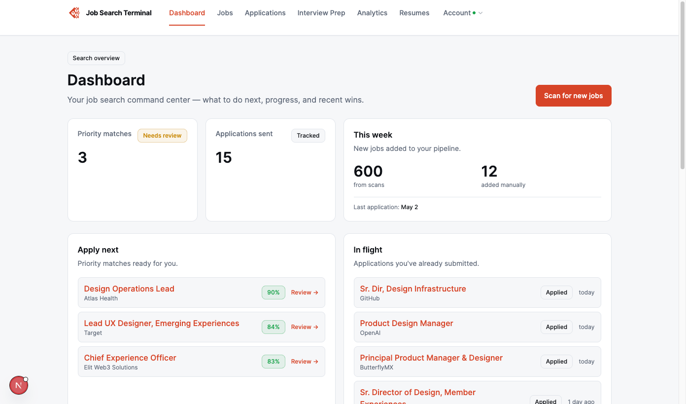
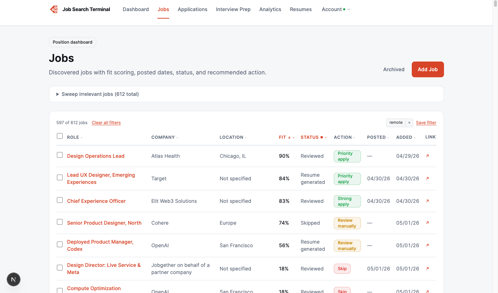
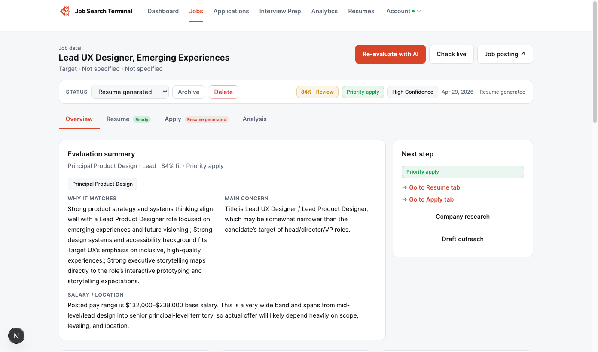
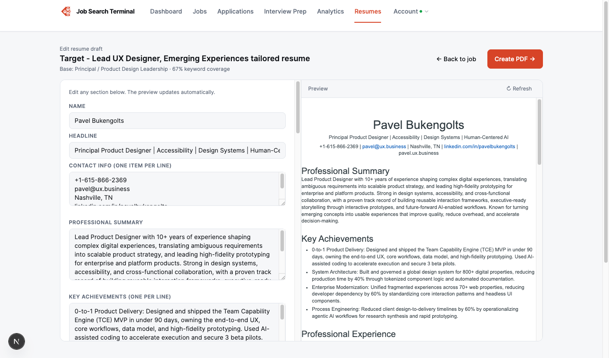
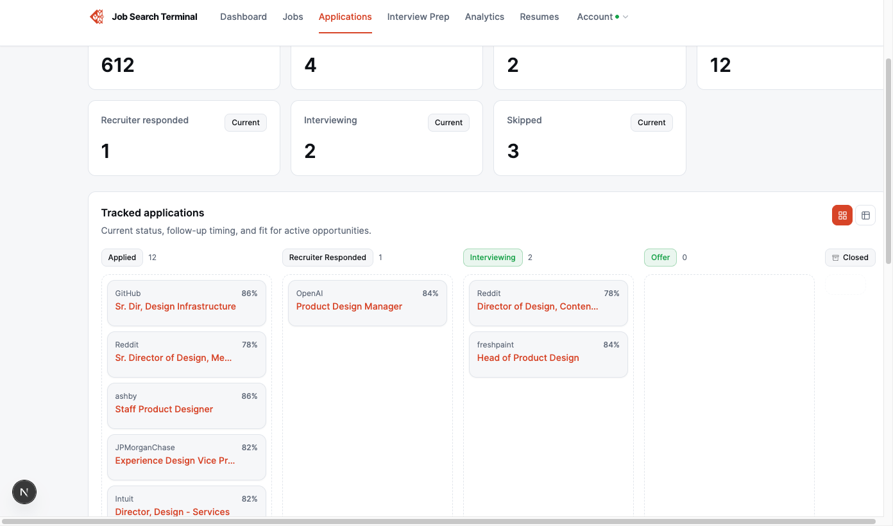
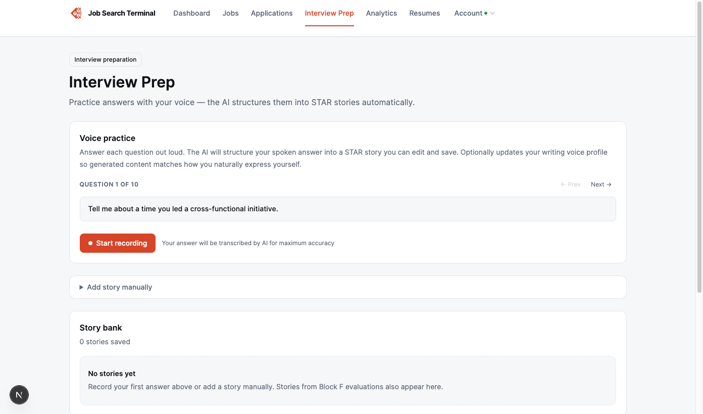
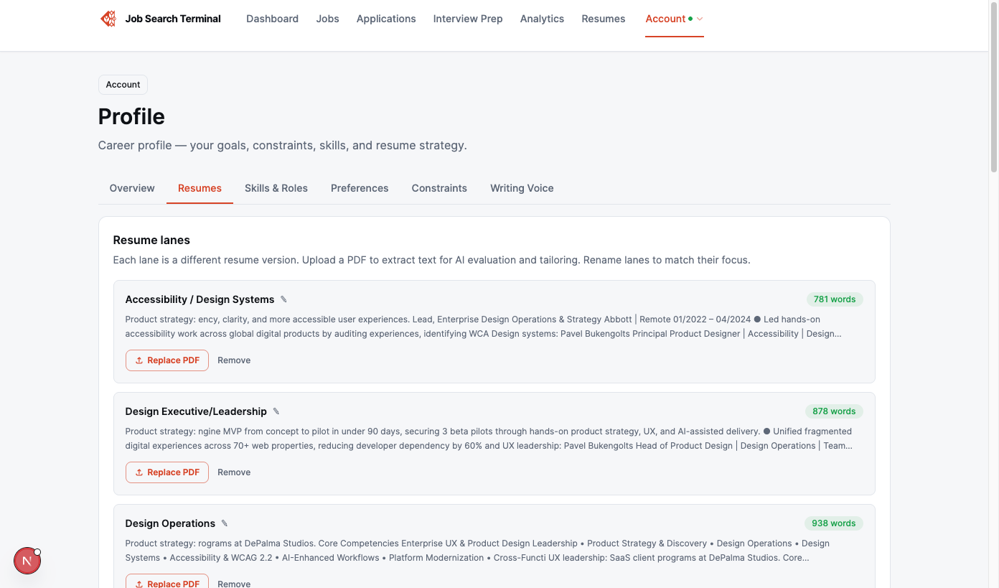
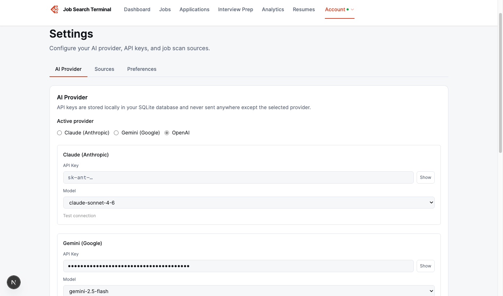

# Job Search Terminal


A free, source-available, local-first job-search dashboard for people who need structure, privacy, and better tools in a brutal job market.

Job Search Terminal helps you scan jobs, score fit with AI, generate tailored resumes, draft application answers, track your pipeline, and prepare for interviews — all on your own computer.

No account. No subscription. No hosted database. Your data stays local.

Licensed for non-commercial use under CC BY-NC 4.0.

---

## Why this exists

The modern job search has become a second job.

You are expected to track scattered postings, customize resumes, answer repetitive application questions, follow up with recruiters, prepare for interviews, and somehow stay sane while rejection emails pile up like unpaid bills.

Most job-search tools either charge people when they are already under pressure, lock personal career data in the cloud, or focus on one small slice of the problem.

Job Search Terminal takes a different approach: a local-first dashboard that gives job seekers a structured operating system for the full search.

This project is free for non-commercial use because job seekers should not have to pay another platform just to manage an already exhausting process.

---

## What it does

- Discovers jobs from company career pages and supported ATS sources.
- Scores each job against your profile using AI.
- Generates tailored resumes for specific roles.
- Drafts application answers for manual copy-paste.
- Tracks applications through a full funnel.
- Helps prepare for interviews with STAR stories and voice practice.
- Supports multiple resume lanes for different career directions.
- Keeps your data in a local SQLite database on your machine.

The app never submits applications for you. You stay in control.

---

## Screenshots










---

## Inspired by Career-Ops

Job Search Terminal was inspired by [Career-Ops](https://github.com/santifer/career-ops) by Santiago Fernández.

Career-Ops is an excellent AI-powered job-search system built around agentic CLI workflows, Claude Code, Gemini CLI, scanning, scoring, tailored PDFs, and pipeline tracking.

Job Search Terminal takes inspiration from that philosophy while pursuing a different product direction: a local-first visual dashboard with guided setup, structured application tracking, resume lanes, interview prep, and support for OpenAI, Anthropic, and Google Gemini.

---

## How Job Search Terminal differs from Career-Ops

| Career-Ops | Job Search Terminal |
|---|---|
| CLI / agentic workflow | Browser-based visual dashboard |
| Optimized for Claude Code and power users | Designed for broader job seekers |
| Markdown, YAML, TSV, and generated reports | SQLite-backed local app |
| Strong batch automation | Strong application tracking and UX flow |
| Terminal dashboard | Web dashboard with guided setup |
| Claude Code first | OpenAI, Anthropic, and Gemini provider support |
| Highly customizable by editing files | Configurable through the app UI |

Both projects share a belief: job seekers need better tools, and those tools should not be locked behind another paid gate.

---

## Quick start

```bash
git clone https://github.com/uxdesignlab/job-search-terminal.git
cd job-search-terminal
npm install
npm run dev
```

Open:

```txt
http://localhost:3000
```

Then follow the 3-step setup wizard:

1. Add an AI API key.
2. Upload your resume.
3. Scan for jobs.

Full setup guide: [docs/getting-started.md](docs/getting-started.md)

---

## Requirements

| Requirement | Details |
|---|---|
| Computer | Mac, Windows with WSL, or Linux |
| Node.js | Version 18 or later |
| Git | Required to clone the repo |
| AI API key | OpenAI, Anthropic, or Google Gemini |
| Google Chrome | Required for local PDF generation |

---

## Documentation

### For users

- [Getting Started](docs/getting-started.md)
- [Features](docs/features.md)
- [Help Site](docs/help-site.md)
- [Browser Job Board Scanner Guide](docs/linkedin-scanner-guide.md)
- [Troubleshooting](docs/troubleshooting.md)
- [Privacy](PRIVACY.md)
- [Legal Disclaimer](LEGAL_DISCLAIMER.md)

### For developers

- [Development Workflow](docs/development-workflow.md)
- [Design System](docs/design-system.md)
- [Data Model](docs/data-model.md)
- [Accessibility Checklist](docs/accessibility-checklist.md)
- [Quality Hardening](docs/quality-hardening.md)
- [Contributing](CONTRIBUTING.md)

---

## Core commands

```bash
npm run dev              # start the development server
npm run build            # production build
npm run lint             # lint check
npm run typecheck        # TypeScript check
npm run quality:check    # accessibility + screenshot checks

npm run db:migrate       # apply pending migrations
npm run db:seed          # initialize an empty local profile
npm run db:reset         # reset local database
npm run db:check         # verify database

npm run data:backup      # create SQLite backup
npm run data:export      # export readable JSON snapshot
```

---

## Stack

| Layer | Technology |
|---|---|
| Framework | Next.js 15, React 19, TypeScript |
| Database | SQLite via better-sqlite3 |
| AI | OpenAI, Anthropic, Google Gemini |
| PDF | Playwright + Chrome |
| Styling | Tailwind CSS with custom design tokens |
| Icons | Lucide React |

---

## Privacy

Job Search Terminal is local-first.

- Your job data, resumes, applications, generated documents, and profile data are stored in a local SQLite database.
- The app does not require an account.
- The app does not use hosted cloud storage.
- Data is sent to an AI provider only when you choose to run an AI action such as evaluation, resume generation, company research, transcription, or writing assistance.
- You are responsible for reviewing your selected AI provider's data policies.

See [PRIVACY.md](PRIVACY.md) for details.

---

## Ethical use

Job Search Terminal is decision-support software.

Do not use it to spam employers, misrepresent qualifications, scrape platforms that prohibit automated access, or submit AI-generated content without review.

The app never auto-submits applications. Every application remains human-controlled.

---

## License

This project is licensed under Creative Commons Attribution-NonCommercial 4.0 International (CC BY-NC 4.0).

You may use, share, and adapt this project for non-commercial purposes with attribution.

Commercial use is not permitted without written permission from the copyright holder.

See [LICENSE](LICENSE).

---

## Attribution

Inspired by [Career-Ops](https://github.com/santifer/career-ops) by Santiago Fernández. See [ATTRIBUTION.md](ATTRIBUTION.md).
